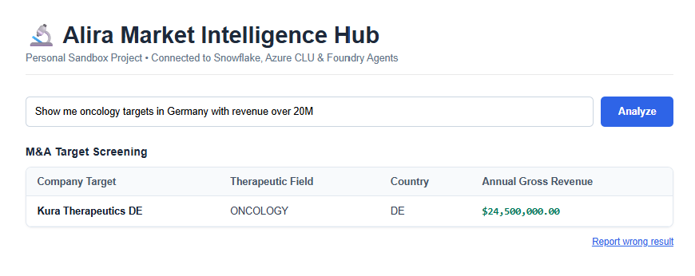
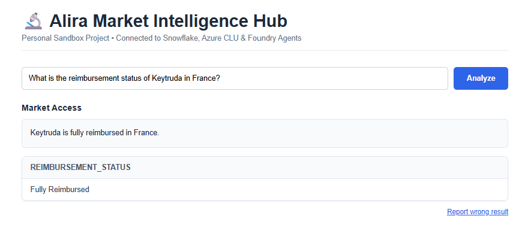
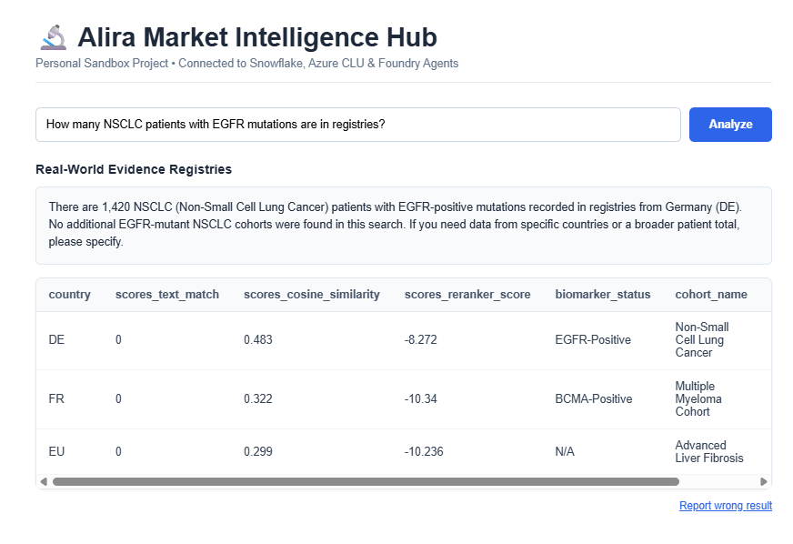

# Alira Health AI Assistant

> **Everything in this repo is a learning artifact.** The *why* behind each decision lives next to
> the code (docstrings and comments), in the [blueprint](<Alira_Health_AI_Assistant_Blueprint (1).md>)
> and in the [DPIA](docs/DPIA_assistant_telemetry.md). It shows how an enterprise NLU assistant ships
> end to end: intent routing, agentic tool use, warehouse security, privacy-safe telemetry, human
> review and metric-gated retraining.

An **all-in-one healthcare consulting assistant** that connects **Azure AI Language (CLU)** and
**Azure AI Foundry agents** to a **Snowflake data warehouse** through a FastAPI middleware layer.
Consultants ask questions in plain English, in a **React web portal** or **Microsoft Teams**, and
get warehouse rows back: M&A target screening, market access pricing and real-world-evidence
registry searches. Every question the assistant handles badly goes to a **data steward review app**,
and approved examples retrain the model weekly behind an **F1 quality gate**.

Built as a personal sandbox project on Azure and Snowflake. All warehouse data is mock data.


---

## What this project teaches you

This is a **Forward Deployed Engineering (FDE) starter kit**: not just a model, but the whole
system around it that a consulting team would actually use.

| If you're a… | You'll learn how to… |
|---|---|
| **AI/NLU engineer** | build a parent–child CLU orchestration, hand some intents to a Foundry agent with MCP tools, and gate retraining on macro F1 plus a regression set |
| **Backend dev** | turn extracted entities into parameterised SQL through a synonym matrix, serve one API to both a web portal and a Teams bot, and return one response shape whichever engine answered |
| **Data engineer** | design least-privilege Snowflake roles, a human-approved training-data view, a Streamlit-in-Snowflake review app and a Snowflake-managed MCP server |
| **DevOps / MLOps engineer** | run weekly retraining in GitHub Actions with staging slots and model pruning, export OpenTelemetry to Application Insights, and deploy retention and dashboards as Bicep |
| **Privacy / security engineer** | pseudonymise users with HMAC, redact confidential target names before they reach logs (fail closed), separate the re-identification key, and write a DPIA from the implementation |

**Key concepts you'll actually be able to explain:** CLU orchestration workflow projects, confidence
thresholds and fallbacks, entity normalisation via a synonym table, SQL-injection-safe parameter
binding, Model Context Protocol (MCP) tool allowlisting, Cortex Analyst and Cortex Search,
human-in-the-loop active learning, quality gates and regression replay, keyed pseudonymisation,
fail-closed redaction, managed-access schemas and KQL drift monitoring.

---

## Highlights

- **3-tier architecture**: React portal / Teams bot → FastAPI gateway → Azure CLU + Foundry → Snowflake
- **Parent–child CLU routing**: `Alira-Master-Orchestrator` routes each question to a practice;
  the `alira-transaction-advisory` child model extracts intent and entities
- **Agentic practices**: market access and RWE questions go to a **Foundry prompt agent** that
  queries Snowflake through a **Snowflake-managed MCP server** (Cortex Analyst → `run_sql`,
  Cortex Search), limited to an explicit tool allowlist
- **Safe SQL**: user terms map to master codes through `VOCABULARY_SYNONYMS`, then bind as
  parameters. An unmapped term skips the query instead of guessing
- **Feedback loop**: low confidence, unmapped terms, zero-row answers and "Report wrong result"
  land in `NLU_FEEDBACK`. A steward approves them in Streamlit, which fixes synonyms immediately
  and adds training data for the next retrain
- **Metric-gated retraining**: weekly GitHub Actions run, macro F1 ≥ 0.85 and macro precision ≥ 0.80,
  regression set replayed on a staging slot before promotion
- **Privacy-safe observability**: HMAC user hashes, company names and figures redacted, 30-day
  retention, KQL workbook for routing drift, unmapped terms and zero-row queries
- **Testing**: 76 deterministic pytest checks with Azure, Snowflake and Foundry mocked (~3 s)

## Tech stack

| Tier | Technology |
|------|------------|
| Presentation | React 19 (Vite 8), inline styles, zero UI libraries · Microsoft Teams bot with Adaptive Cards |
| Application | FastAPI (Python 3.12), `microsoft-teams-apps` SDK |
| NLU | Azure AI Language: CLU orchestration project + conversation child project |
| Agent | Azure AI Foundry prompt agent (`azure-ai-projects`) with an MCP tool |
| Data | Snowflake: warehouse tables, synonym matrix, Cortex Analyst (semantic model), Cortex Search, managed MCP server |
| Review app | Streamlit in Snowflake |
| Observability | OpenTelemetry → Azure Monitor / Application Insights, KQL workbook deployed with Bicep |
| CI/CD | GitHub Actions: weekly metric-gated CLU retraining |
| Auth to cloud | `DefaultAzureCredential` (`az login` locally, managed identity in Azure), Snowflake key-pair auth |

## How a question flows

```
 Consultant ──► React portal (POST /query)   or   Microsoft Teams (POST /api/messages)
                                   │
                                   ▼
                      FastAPI gateway  (main.py)
                                   │
                 Azure CLU orchestrator  (Alira-Master-Orchestrator)
                                   │
       ┌───────────────────────────┼─────────────────────────────┐
       ▼                           ▼                             ▼
 Alira-MA-DueDiligence    Alira-MarketAccess / Alira-RWE      None (low confidence)
 child CLU model          Foundry agent ──MCP──► Snowflake     polite fallback
 synonyms → bound SQL     Cortex Analyst · Cortex Search
       │                           │                             │
       └──────────── rows + redacted telemetry event ────────────┘
                                   │
    misses ──► NLU_FEEDBACK ──► steward review app ──► weekly gated CLU retrain
```

## Screenshots

One screen for each practice. The portal renders every answer from the same `{type, message, data}`
payload, whichever engine produced it.

**M&A target screening**: the child CLU model extracts *oncology*, *Germany* and *20M*, the synonym
table maps them to master codes, and a parameterised query returns matching targets.



**Market access**: the Foundry agent calls Cortex Analyst for the SQL, runs it with `run_sql`, and
answers in prose above the rows it got back.



**Real-world evidence**: the agent searches registry cohorts with Cortex Search. Result columns come
from the rows themselves, so search scores (`scores_cosine_similarity`, `scores_reranker_score`)
appear alongside cohort data.



Every answer carries a **Report wrong result** link, which sends the question to the data steward's review queue.

---

## Quickstart

Requirements: Python 3.12, Node 22, the Azure CLI, an **Azure AI Language** resource with custom
features, an **Azure AI Foundry** project and a **Snowflake** account.

### 1. One-time cloud setup

1. **Azure AI Language**: create the resource and assign RBAC roles
   (blueprint Steps 1–2).
2. **Snowflake**: create `ALIRA_DW.ASSISTANT` with `M_AND_A_TARGETS`, `VOCABULARY_SYNONYMS` and the
   `ALIRA_BOT_WH` warehouse (DDL in blueprint Step 3). Then run [`sql/phase5_observability.sql`](sql/phase5_observability.sql)
   for the feedback table, redaction list, identity store, roles and review app.
3. **Foundry**: deploy a model, add a project connection holding the header
   `Authorization: Bearer <Snowflake PAT>`, and expose the MCP server named in
   [`agent_config.yaml`](agent_config.yaml) with the tools `market_access_analyst`,
   `rwe_registry_search` and `run_sql`.
4. **Monitoring** (optional): `az deployment group create --template-file monitoring/observability.bicep ...`

### 2. Backend

```bash
python -m venv .venv
.venv\Scripts\activate                    # Windows  (macOS/Linux: source .venv/bin/activate)
pip install -r requirements.txt
az login                                  # Foundry uses DefaultAzureCredential

# create .env with the variables in the table below, then:
python deploy_clu.py                      # import, train, deploy the child CLU model, then the orchestrator
python foundry_orchestrator.py publish    # push agent_config.yaml as a new agent version
python foundry_orchestrator.py ask "What is the approved price of Keytruda in Germany"   # agent smoke test

.venv\Scripts\python.exe -m uvicorn main:app --reload --port 8000    # API on :8000
```

> Once retraining has run, `python deploy_clu.py` with no arguments re-imports the child model from
> its seed file and **drops approved utterances**. Pass `clu_orchestrator_dataset.json` alone for
> orchestrator-only changes.

### 3. Frontend (separate terminal)

```bash
cd frontend
npm install
npm run dev                               # UI on :5173, calls the API at http://localhost:8000
```

Open `http://localhost:5173` (a local URL on *your* machine). There is no login in the sandbox
build: every query runs as a mock user.

### Environment variables (`.env`)

| Variable | Used by | Purpose |
|---|---|---|
| `AZURE_LANGUAGE_ENDPOINT`, `AZURE_LANGUAGE_KEY` | engine, `deploy_clu.py`, retraining | Azure AI Language resource |
| `SNOWFLAKE_ACCOUNT`, `SNOWFLAKE_USER`, `SNOWFLAKE_WAREHOUSE` | engine, retraining | Warehouse connection |
| `SNOWFLAKE_PRIVATE_KEY_FILE` | engine | Key-pair auth (CI passes `SNOWFLAKE_PRIVATE_KEY` + passphrase instead) |
| `FOUNDRY_PROJECT_ENDPOINT` | agent | `https://<resource>.services.ai.azure.com/api/projects/<project>`, not the `/openai/v1` endpoint |
| `FOUNDRY_MODEL_DEPLOYMENT_NAME` | agent | Model deployment the agent runs on |
| `SNOWFLAKE_MCP_CONNECTION_NAME` | agent | Foundry project connection that holds the Snowflake PAT |
| `APPLICATIONINSIGHTS_CONNECTION_STRING` | telemetry | Optional. When set, telemetry is exported |
| `TELEMETRY_HMAC_SECRET` | telemetry | **Required** when exporting; the API refuses to start without it |
| `CLIENT_ID`, `CLIENT_SECRET`, `TENANT_ID` | Teams bot | Bot credentials; JWT validation turns on when `CLIENT_ID` is set |

### Try it

| Practice | Example prompt | Answered by |
|---|---|---|
| M&A due diligence | `Show me oncology targets in Germany with revenue over 20M` | Child CLU → synonym lookup → bound SQL |
| Market access | `What is the reimbursement status of Keytruda in France?` | Foundry agent → Cortex Analyst → `run_sql` |
| Real-world evidence | `How many NSCLC patients with EGFR mutations are in registries?` | Foundry agent → Cortex Search |
| Out of scope | `Reset my laptop password` | Low-confidence fallback, logged for review |

### API

| Method | Path | What it does |
|---|---|---|
| `GET` | `/` | Health check |
| `POST` | `/query` | `{prompt}` → `{type, message, data}` with an `X-Trace-Id` header |
| `POST` | `/feedback` | `{trace_id, prompt}`: consultant flags a wrong answer for the steward |
| `POST` | `/api/messages` | Microsoft Teams messaging endpoint |

### Tests & quality gates

```bash
python -m pytest                          # 76 deterministic checks, cloud services mocked (~3 s)
python scripts/retrain_clu.py             # quality gate vs LIVE Azure CLU + Snowflake (DEPLOY=false: gate + staging only)
```

The retraining script merges steward-approved utterances into the seed dataset, labels their
entities, trains on an 80/20 split and **blocks deployment** below macro F1 0.85 or macro precision
0.80. It then replays [`clu_regression_set.json`](clu_regression_set.json) against the staging slot,
and only promotes to `production-v1` (then retrains the orchestrator) when every case passes.

[`.github/workflows/retrain_clu.yml`](.github/workflows/retrain_clu.yml) runs it every Monday at
02:00 UTC, on demand, and on pull requests that touch the datasets or the gate. Only the default
branch promotes; other branches train in a separate `alira-transaction-advisory-ci` project.

---

## Feature tour by role

| Role | What they can do |
|------|------------------|
| **Consultant** | Ask questions in the web portal or Teams across three practices; flag an answer with "Report wrong result" |
| **Data steward** (`ALIRA_DATA_STEWARD`) | Open the NLU feedback review app; approve rows with the intended intent (training data) or map an unmapped term to a master code (fixes the query for everyone at once) |
| **Deal team** | Add confidential target names and codenames to `REDACTION_WATCHLIST`; the API redacts them within an hour |
| **Privacy officer** (`ALIRA_PRIVACY_OFFICER`) | The only role that can read `USER_HASH_MAP` and re-identify a `user_hash` |
| **API service** (`ALIRA_ASSISTANT_API`) | Read targets and synonyms, insert feedback, append to the identity map (never read it) |
| **Retraining job** (`ALIRA_CLU_RETRAIN`) | Read approved training rows and the synonym vocabulary only |

Full privilege split: [`sql/phase5_observability.sql`](sql/phase5_observability.sql).
What is stored where, for how long: [`docs/DPIA_assistant_telemetry.md`](docs/DPIA_assistant_telemetry.md).

---

## Project structure

```
├── main.py                        # FastAPI gateway: /query, /feedback, Teams endpoint, telemetry setup
├── snowflake_engine.py            # CLU routing, synonym lookup, bound SQL, feedback capture
├── foundry_orchestrator.py        # Foundry agent: config validation, publish, ask, MCP result parsing
├── teams_bot.py                   # Microsoft Teams bot, results as Adaptive Card tables
├── telemetry.py                   # HMAC pseudonymisation, fail-closed redaction, structured events
├── deploy_clu.py                  # Import, train and deploy the CLU projects
├── agent_config.yaml              # Source of truth for the Foundry agent and its tool allowlist
├── market_access_model.yaml       # Cortex Analyst semantic model for market access pricing
├── clu_base_dataset.json          # Child CLU seed dataset (alira-transaction-advisory)
├── clu_orchestrator_dataset.json  # Orchestrator dataset (practice routing)
├── clu_regression_set.json        # Cases replayed against staging before promotion
├── test_*.py                      # 76 deterministic pytest checks
├── scripts/retrain_clu.py         # Weekly retraining with quality gate + regression replay
├── feedback_review_app/           # Streamlit-in-Snowflake NLU feedback review app
├── sql/                           # Feedback, redaction, identity store, roles, review app
├── monitoring/                    # Bicep (retention + workbook), KQL dashboards
├── frontend/                      # React (Vite) Market Intelligence Hub portal
├── docs/                          # DPIA for telemetry and the feedback loop
├── image/                         # Portal screenshots used in this README
├── logs/                          # Local agent orchestration traces (no raw questions)
└── .github/workflows/             # CLU retraining pipeline
```

## Documentation

| Doc | What it answers |
|-----|-----------------|
| [`Alira_Health_AI_Assistant_Blueprint (1).md`](<Alira_Health_AI_Assistant_Blueprint (1).md>) | Architecture deep-dive: why each component exists, end-to-end flows, learning path, one-time cloud setup |
| [`docs/DPIA_assistant_telemetry.md`](docs/DPIA_assistant_telemetry.md) | Data inventory, data flow, privacy controls, residual risks, sign-off decisions |
| [`agent_config.yaml`](agent_config.yaml) | How the orchestrator agent picks and uses its MCP tools |
| [`market_access_model.yaml`](market_access_model.yaml) | The semantic layer Cortex Analyst generates market access SQL from |
| [`monitoring/kql/`](monitoring/kql/) | Dashboards: unmapped terms, routing confidence drift, zero-row queries |
| [`sql/phase5_observability.sql`](sql/phase5_observability.sql) | Feedback loop schema and the role separation behind it |

## Known gaps

- **No authentication on `/query` and `/feedback`.** The portal sends a mock user. The Entra ID
  `Data.Query` scope from blueprint Step 2 is not wired in yet; the DPIA marks this blocking for a pilot (R5).
- **`Dockerfile.dev` is out of date.** It copies `requirements-dev.txt` and starts `app.main:create_app`,
  neither of which exists. Run `uvicorn main:app` as shown above.
- **Snowflake Cortex objects aren't scripted.** The semantic model, the RWE search service and the MCP
  server must be created by hand.
- **`GetDealComparables` has no SQL mapping yet.** The intent is trained, but the engine replies that no mapping exists.
- **CI doesn't run the pytest suite or the frontend build**; only the retraining workflow exists.
- **The portal hardcodes `http://localhost:8000`** as the API address.

## License

Personal sandbox / educational project with mock data. Not for production use.
